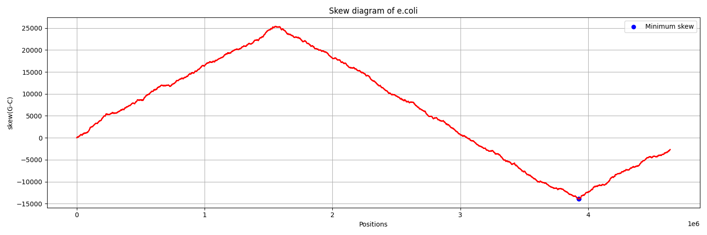

# GC Skew Analysis of E.coli Genome

This project analyzes the GC skew of the **E.coli** genome to identify the **origin of replication** using a **minimum skew algorithm**. The analysis includes computing the skew array and plotting the skew diagram with key points marked.

---

## 📁 Files

- `ecoli.fna`: Input FASTA file containing the E.coli genome.
- `script.py`: Python script that performs skew analysis.
- `result.txt`: Text file output listing positions of **minimum skew**.
- `results/SkewMinimumGraph.png`: Saved plot of the GC skew diagram.
- `README.md`: Project documentation.

---

## 📊 Output

The script:
- Computes the skew array (G − C count over genome).
- Identifies positions with **minimum skew** — likely origins of replication.
- Plots the **GC skew diagram** with the minimum skew point(s) marked in **blue**.



---

## 🚀 How to Run

### Requirements:
- Python ≥ 3.8  
- Libraries:
  ```bash
  pip install matplotlib

## Code
python script.py


---


## 💡 Output Example 
Minimum Skew Positions (likely origin of replication):  
[4060844]


--- 
## 📌 Notes
-Skew diagram helps in identifying oriC (origin of replication).
-Only "G" and "C" affect the skew values:
-G ➜ +1
-C ➜ -1
-A/T ➜ 0 (no change)


---


## 👨‍💻 Author
Madhav Takkar 


--- 


## License
This Project is for educational purposes

